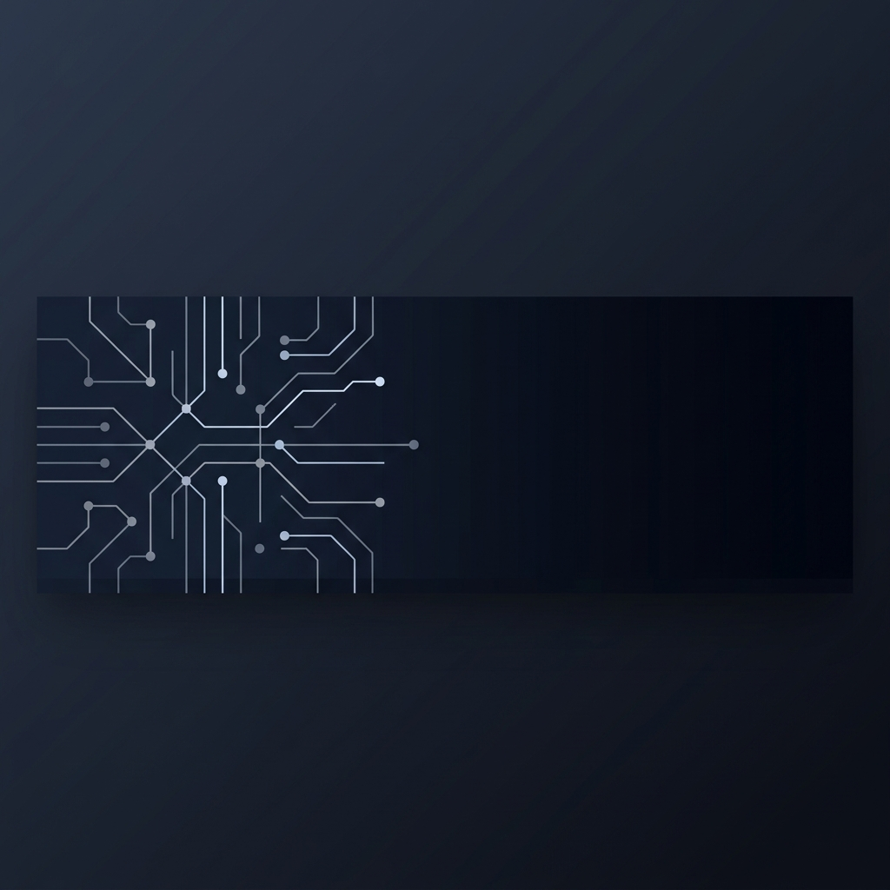

<div align="center">
  
</div>

<br/>

<h3 align="center">
  <samp>Sai Asish Yamani</samp>
</h3>

<p align="center">
  <samp>Systems Engineer · Distributed Systems · High-Performance Computing</samp>
</p>

<p align="center">
  <a href="https://www.linkedin.com/in/saiasishy/">linkedin</a> · 
  <a href="mailto:saiasish.cnp@gmail.com">email</a> · 
  <a href="https://github.com/SAY-5">github</a>
</p>

---

<br/>

```
> whoami

  Systems & Distributed Systems Engineer
  MS Computer Science — Stony Brook University
  Previously at Microsoft, Nokia

> cat domains.yml

  - Distributed Databases & Transaction Engines
  - GPU-Accelerated Computing (CUDA, MPI, OpenMP)
  - Storage Engines, LSM Trees, MVCC
  - Query Optimization & Parallel Pipelines

> echo $STACK

  C++ · Python · Java · Go · CUDA · Kafka · gRPC
  PostgreSQL · Redis · Cassandra · Milvus
  Docker · Kubernetes · Jenkins
```

<br/>

## Impact

<table>
<tr>
<td width="50%">

**Microsoft** — Software Engineer

Optimized Azure MeTA serving layer.
<br/>↳ **20% latency reduction** across **100M+ users**
<br/>↳ **99.99% uptime** for 50K+ enterprise tenants

</td>
<td width="50%">

**CUBIT Lab, Stony Brook** — Research Assistant

Parallel biomedical data pipelines on HPC clusters.
<br/>↳ **35% runtime reduction** on **3TB+ datasets**
<br/>↳ PostgreSQL + Redis for 15K+ genomic records

</td>
</tr>
<tr>
<td width="50%">

**Nokia** — Software Engineer Intern

Real-time 5G network event processing.
<br/>↳ **80K+ events/day** pipeline
<br/>↳ Dockerized builds saving **100+ dev-hours/week**

</td>
<td width="50%">

**What I'm building now**

Open-source distributed systems tooling.
<br/>↳ Storage engine internals
<br/>↳ Consensus protocols & replication
<br/>↳ Vector index optimization

</td>
</tr>
</table>

<br/>

## Selected Work

| | Project | What it does | Stack |
|:--|:--------|:-------------|:------|
| 01 | **DistributedDB** | ACID-compliant distributed database — 1M+ transactions, <500ms p99 latency, B+ tree indexing | `C++` `WAL` `Consistent Hashing` |
| 02 | **TransactionChain** | Distributed transaction engine — 10K+ tx/sec, Raft consensus, 30% lower latency | `Java` `Kafka` `gRPC` `2PC` |
| 03 | **VectorDB Optimizer** | HNSW index tuning — recall@10 improved 0.85→0.94, 45ms query latency | `Milvus` `Weaviate` `CUDA` |

<br/>

## Stats

<div align="center">
  <picture>
    <source media="(prefers-color-scheme: dark)" srcset="https://github-readme-stats.vercel.app/api?username=SAY-5&show_icons=true&hide_border=true&bg_color=00000000&title_color=c9d1d9&text_color=9f9f9f&icon_color=58a6ff&ring_color=58a6ff" />
    <source media="(prefers-color-scheme: light)" srcset="https://github-readme-stats.vercel.app/api?username=SAY-5&show_icons=true&hide_border=true&bg_color=00000000&title_color=24292f&text_color=57606a&icon_color=0969da&ring_color=0969da" />
    
  </picture>
  <picture>
    <source media="(prefers-color-scheme: dark)" srcset="https://github-readme-stats.vercel.app/api/top-langs/?username=SAY-5&layout=compact&hide_border=true&bg_color=00000000&title_color=c9d1d9&text_color=9f9f9f&langs_count=6" />
    <source media="(prefers-color-scheme: light)" srcset="https://github-readme-stats.vercel.app/api/top-langs/?username=SAY-5&layout=compact&hide_border=true&bg_color=00000000&title_color=24292f&text_color=57606a&langs_count=6" />
    
  </picture>
</div>

<br/>

---

<p align="center">
  <samp>
    <i>"Make it work. Make it right. Make it fast."</i>
  </samp>
</p>