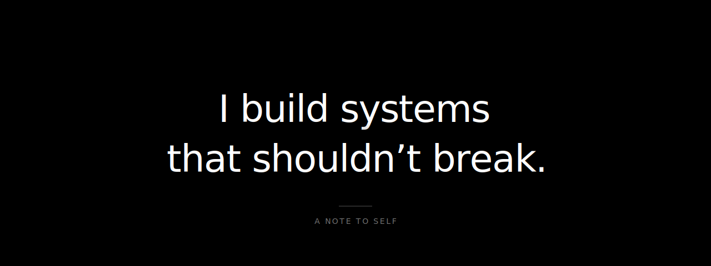

  

&nbsp;

  

&nbsp;

  

&nbsp;

  

&nbsp;

  <a href="https://sayportfolio.vercel.app/">Portfolio</a>&nbsp;&nbsp;·&nbsp;&nbsp;
  <a href="https://www.linkedin.com/in/saiasishy/">LinkedIn</a>&nbsp;&nbsp;·&nbsp;&nbsp;
  <a href="mailto:saiasish.cnp@gmail.com">Email</a>

  Santa Clara, CA &nbsp;·&nbsp; <i>Available for work</i>

