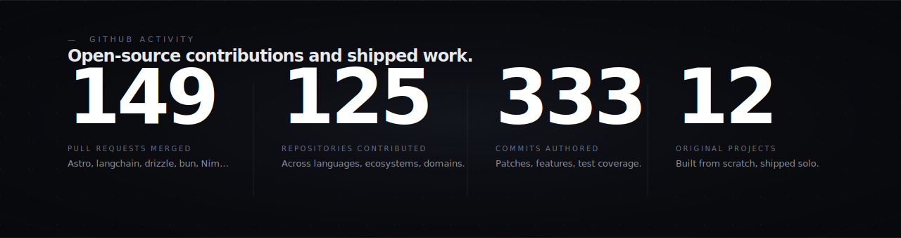
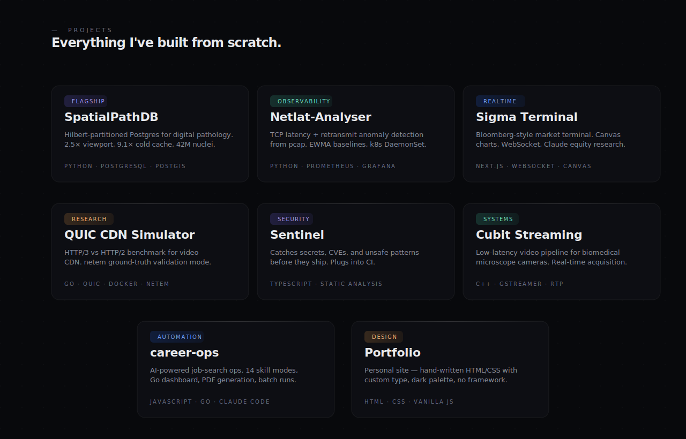
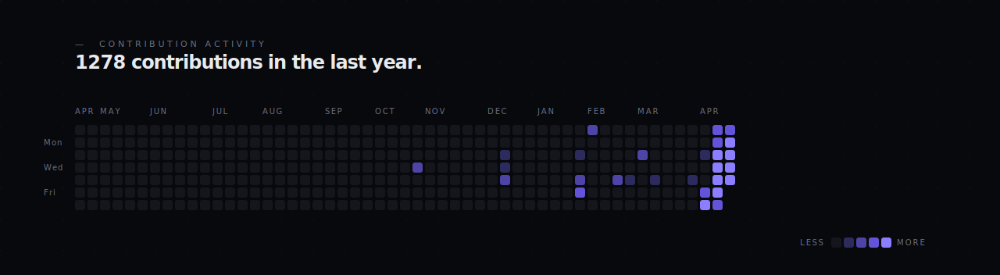

  

  <a href="https://sayportfolio.vercel.app/"><kbd>&nbsp;&nbsp;Portfolio&nbsp;&nbsp;</kbd></a>&nbsp;
  <a href="https://www.linkedin.com/in/saiasishy/"><kbd>&nbsp;&nbsp;LinkedIn&nbsp;&nbsp;</kbd></a>&nbsp;
  <a href="mailto:saiasish.cnp@gmail.com"><kbd>&nbsp;&nbsp;Email&nbsp;&nbsp;</kbd></a>&nbsp;
  <a href="https://github.com/SAY-5?tab=repositories"><kbd>&nbsp;&nbsp;Repositories&nbsp;&nbsp;</kbd></a>

  

  

  

  Open to building hard systems with thoughtful people. &nbsp;·&nbsp; <a href="mailto:saiasish.cnp@gmail.com">Let's talk →</a>

