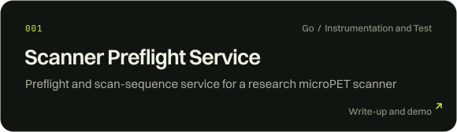
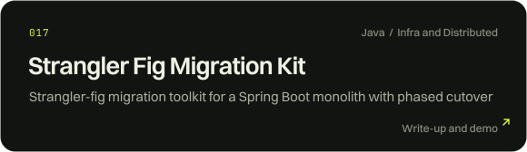
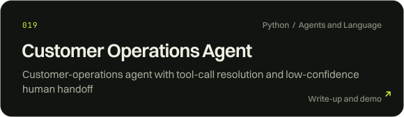
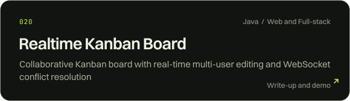
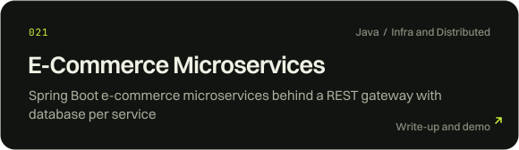
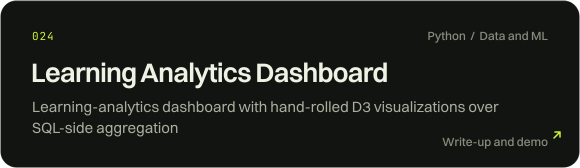
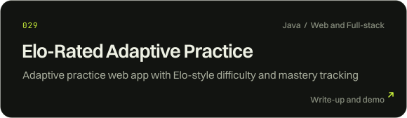
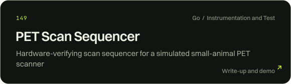
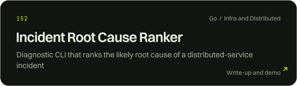
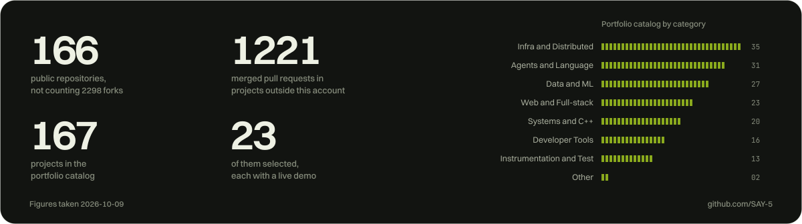

<a href="https://sayportfolio.vercel.app"></a>

  <a href="https://sayportfolio.vercel.app">Portfolio</a> &nbsp;&middot;&nbsp;
  <a href="https://showcases-lime.vercel.app">Live demos</a> &nbsp;&middot;&nbsp;
  <a href="https://www.linkedin.com/in/saiasishy/">LinkedIn</a> &nbsp;&middot;&nbsp;
  <a href="mailto:saiasish.cnp@gmail.com">saiasish.cnp@gmail.com</a>

Software engineer working on distributed systems, low latency infrastructure, and databases. MS in Computer Science from Stony Brook University, B.Tech from VIT. Previously at Nokia and in two research labs, CUBIT and the Data Management and Biomedical Analytics Lab. Open to SDE and SWE roles.

## Recent releases

The latest release of each repository, read from GitHub on 2026-10-09. GitHub did not answer for kernelcheck, rankfault; those entries show the release last read. Each title links to the write-up, or to the repository where there is no write-up yet.

- <a href="https://sayportfolio.vercel.app/p/modelgate"><b>ETA Model Serving</b></a> <a href="https://github.com/SAY-5/modelgate">modelgate</a> &middot; <a href="https://github.com/SAY-5/modelgate/releases/tag/v5.0.2">v5.0.2</a>, 2026-09-29 FastAPI serving for a PyTorch ETA model: strict input validation, shadow runs, canaries with automatic rollback, and version swaps load-tested with 0 dropped requests.

- <a href="https://sayportfolio.vercel.app/p/dispatchgrid"><b>Streams Ride Matcher</b></a> <a href="https://github.com/SAY-5/dispatchgrid">dispatchgrid</a> &middot; <a href="https://github.com/SAY-5/dispatchgrid/releases/tag/v5.2.0">v5.2.0</a>, 2026-09-29 Ride matching on Kafka Streams in Java 21 and Spring Boot 3, with trips in city-keyed MySQL shards, driver positions in Redis GEO and zero-downtime rolling updates on Kubernetes.

- <a href="https://sayportfolio.vercel.app/p/failsafe"><b>Resilient API Gateway</b></a> <a href="https://github.com/SAY-5/failsafe">failsafe</a> &middot; <a href="https://github.com/SAY-5/failsafe/releases/tag/v5.0.2">v5.0.2</a>, 2026-09-29 Python API gateway with token-bucket rate limiting, per-replica circuit breakers, retries and failover; its chaos runs kill replicas under load with zero client-visible failures.

- <a href="https://sayportfolio.vercel.app/p/ledgermesh"><b>Order Saga With Chaos Proof</b></a> <a href="https://github.com/SAY-5/ledgermesh">ledgermesh</a> &middot; <a href="https://github.com/SAY-5/ledgermesh/releases/tag/v6.0.0">v6.0.0</a>, 2026-09-29 Order saga across three Spring Boot services with Kafka, Redis and Resilience4j; in the recorded chaos run, 1200 orders under three service kills ended with none failed or stuck.

- <a href="https://sayportfolio.vercel.app/p/kernelcheck"><b>CUDA Kernel Fuzz Tester</b></a> <a href="https://github.com/SAY-5/kernelcheck">kernelcheck</a> &middot; <a href="https://github.com/SAY-5/kernelcheck/releases/tag/v4.0.0">v4.0.0</a>, 2026-09-29 Differential fuzz tester for CUDA C++ kernels on a CPU execution model, never run on a GPU; it detected 156 of 171 seeded mutants, and the 15 it missed are equivalent under the kernels' contracts.

- <a href="https://sayportfolio.vercel.app/p/panelist"><b>Expert Grading And Delivery Platform</b></a> <a href="https://github.com/SAY-5/panelist">panelist</a> &middot; <a href="https://github.com/SAY-5/panelist/releases/tag/v6.0.0">v6.0.0</a>, 2026-09-28 Expert grading platform: tasks routed by expertise tag, hidden attention checks, pay per approved task, and approved grades exported as versioned, checksummed JSONL datasets.

- <a href="https://sayportfolio.vercel.app/p/tradegraph"><b>Ownership And Exposure Graph</b></a> <a href="https://github.com/SAY-5/tradegraph">tradegraph</a> &middot; <a href="https://github.com/SAY-5/tradegraph/releases/tag/v5.1.1">v5.1.1</a>, 2026-09-28 Counterparty knowledge graph from SEC filings: a Python ETL loads RDF into a SPARQL store, a Spring Boot API answers lineage and exposure queries, and an Angular explorer draws it.

- <a href="https://sayportfolio.vercel.app/p/conduit"><b>Declarative Connector Pipeline</b></a> <a href="https://github.com/SAY-5/conduit">conduit</a> &middot; <a href="https://github.com/SAY-5/conduit/releases/tag/v6.0.0">v6.0.0</a>, 2026-09-28 Connector kit with one adapter interface for Slack, Jira and signed webhooks: idempotency keys, backoff, a circuit breaker per connector and an SQS dead-letter queue.

- <a href="https://sayportfolio.vercel.app/p/rankfault"><b>Collective Fault Injection Harness</b></a> <a href="https://github.com/SAY-5/rankfault">rankfault</a> &middot; <a href="https://github.com/SAY-5/rankfault/releases/tag/v5.0.0">v5.0.0</a>, 2026-09-28 Fault injection for multi-rank PyTorch jobs: kills, freezes, link faults and ordering skew injected mid-collective; measured with gloo on CPU on Linux, 0 of 114 runs stalled, NCCL never run.

- <a href="https://sayportfolio.vercel.app/p/launchbridge"><b>Signed Webhook Integration Service</b></a> <a href="https://github.com/SAY-5/launchbridge">launchbridge</a> &middot; <a href="https://github.com/SAY-5/launchbridge/releases/tag/v5.1.0">v5.1.0</a>, 2026-09-27 FastAPI and PostgreSQL integration service: signed inbound webhooks, deduplication, bounded retries, replay of failed events and secret rotation.

- <a href="https://sayportfolio.vercel.app/p/playbook"><b>Procedure To Agent Pipeline</b></a> <a href="https://github.com/SAY-5/playbook">playbook</a> &middot; <a href="https://github.com/SAY-5/playbook/releases/tag/v6.0.0">v6.0.0</a>, 2026-09-27 Turns an expert's walkthrough and SOP into a tool-calling agent with Jira and Slack tools, grades its runs against the expert's rubric and feeds failures back as corrections.

- <a href="https://sayportfolio.vercel.app/p/spoofline"><b>Two-Stream Spoof Detection</b></a> <a href="https://github.com/SAY-5/spoofline">spoofline</a> &middot; <a href="https://github.com/SAY-5/spoofline/releases/tag/v5.1.0">v5.1.0</a>, 2026-09-27 Audio and video spoof detection with a CNN-LSTM per stream, calibrated and fused, evaluated on attack families held out of training, on a deterministically generated corpus.

- <a href="https://sayportfolio.vercel.app/p/expertloop"><b>Notes To Agent Instructions</b></a> <a href="https://github.com/SAY-5/expertloop">expertloop</a> &middot; <a href="https://github.com/SAY-5/expertloop/releases/tag/v5.1.0">v5.1.0</a>, 2026-09-27 Turns expert task notes into versioned agent instructions with linked sources, and gates approved workflows behind test cases before they reach business systems.

- <a href="https://sayportfolio.vercel.app/p/rideloop"><b>Ride Dispatch Platform</b></a> <a href="https://github.com/SAY-5/rideloop">rideloop</a> &middot; <a href="https://github.com/SAY-5/rideloop/releases/tag/v5.0.0">v5.0.0</a>, 2026-09-08 Ride request, driver location and dispatch services in Python, with a geohash-partitioned DynamoDB driver index, PostgreSQL trips and a React rider map.

## Selected work

Each card opens the write-up; every one of these has a demo that runs in the browser.

<a href="https://sayportfolio.vercel.app/p/scanguard"></a>
<a href="https://sayportfolio.vercel.app/p/cloudshift"></a>
<a href="https://sayportfolio.vercel.app/p/agentdesk"></a>
<a href="https://sayportfolio.vercel.app/p/taskboard"></a>
<a href="https://sayportfolio.vercel.app/p/shopflow"></a>
<a href="https://sayportfolio.vercel.app/p/gradeview"></a>

<a href="https://sayportfolio.vercel.app/p/learnloop"></a>
<a href="https://sayportfolio.vercel.app/p/scan-sequencer"></a>
<a href="https://sayportfolio.vercel.app/p/diagkit"></a>

<a href="https://sayportfolio.vercel.app/work"></a>

## Open source

1221 merged pull requests in projects outside this account (as of 2026-10-09) across the JavaScript, Python, Go, and Rust ecosystems. Until May 2026 the approach was volume; since May 5, 2026 it is one issue at a time: reproduce it, fix it, test it, and land a single clean change. Apologies to the maintainers who dealt with duplicate or half-tested PRs before that.

## Contributions

Assets are generated from the portfolio's project data, the GitHub API and <code>data/recent-work.json</code> by <code>scripts/build.mjs</code> and refreshed daily.
